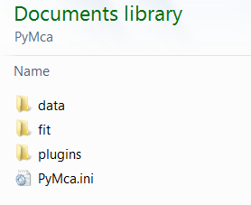

Settings
========

.. |img_02| image:: ./img/settings_02.png
   :align: middle
   :alt: File mneu

.. contents::
   :local:

PyMca allows a certain level of customization via user settings.

Settings Directory
------------------

The first time *PyMca*  is started, it creates a user accessible settings directory to allow user customization up to a certain extent.

The location and name of this settings directory is different following the operation system.

The typical layout of the directory is shown below

|img_01|

Windows
.......

The name of the folder is PyMca and it is located in the Documents folder of the user. The idea is that this folder should be easily accessible by the user and this location seems preferable to the use of a hidden folder.

MacOS, Linux,...
................

The settings directory is created in the user $HOME directory.

The name of the directory was PyMca in older versions of the program. Recent versions try to use the more standard way of using a .pymca directory. Nevertheless, if they find a PyMca directory at the $HOME level, they will keep using it.

GUI settings
------------

Graphical user interfaces are nice to start but sometimes they require a lot of interaction from the user.

In an attempt to minimize the amount of user interaction, *PyMca* allows to save some settings like main window geometry, open files, last used directory, fit configuration, ROI table configuration...

|img_02|

This feature is accessible from the File menu either by choosing *File->Save default settings* or *File->Save->PyMca Configuration* This creates a .ini file in the user accessible settings folder of PyMca created when first using the program.

The PyMca.ini file contains the default settings used by the application on start up. They can be bypassed by a fresh start of PyMca (typing *pymca -f*  from the command line or selecting "*PyMca Fresh Start* from the Windows start menu).

XRF Database
------------

The subdirectory data allows the user to modify the data used by *PyMca* when performing X-ray fluorescence calculations. It is enough to copy to this directory any of the original ASCII files contained in the `fisx_data <https://github.com/vasole/fisx/tree/master/fisx_data>`_ directory of the fisx module to force the program to use that file. The user can then proceed to edit the file and PyMca will use the modified file the next time is started.

If you are interested in modifying the data used by *PyMca* the is an `exercise <../../training/xraydata/index.html>`_ to teach you how to proceed.

CAUTION: At this point it is not advisable to modify the EADL97_* or the XCOM_CrossSections.dat files.

CAUTION: Those files use unix line endings (LF) and not windows line endings (CR/LF). If you are under windows you have to make sure you do not use an editor modifying line endings. Convenient and free editors for windows are `Notepad++ <https://notepad-plus-plus.org>`_ or `Vim for windows <https://www.vim.org>`_

User Plugins
------------

The subdirectory plugins contains the user plugins to be used in the application. Please refer to the plugins documentation for details.

