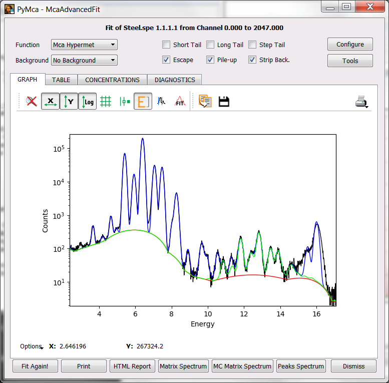
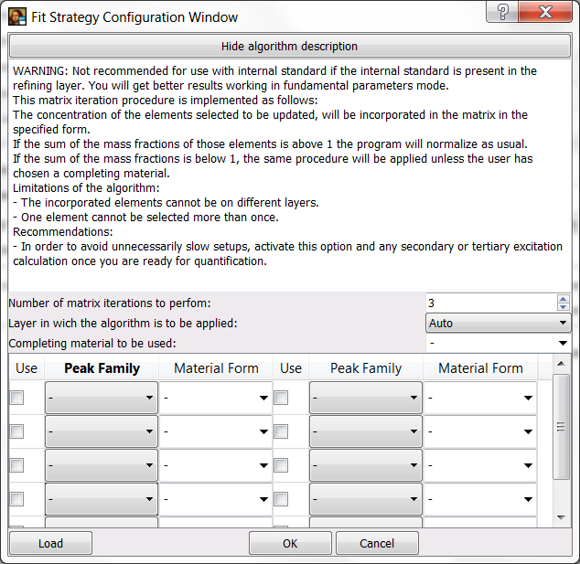
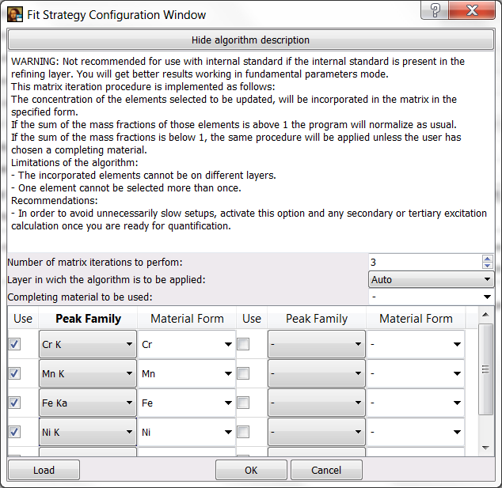
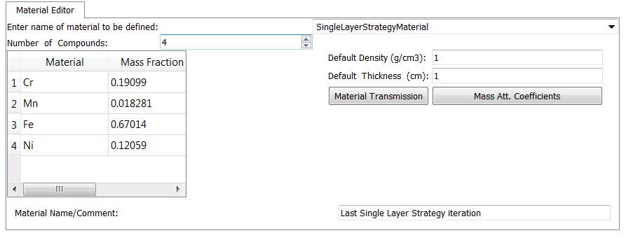

Automatic Sample Matrix Refinement
==================================

.. contents::
   :local:

Introduction
------------

The characterization of the experimental setup (excitation beam, filters, attenuators, detector, geometry) and theoretical peak ratios are not sufficient to appropriately quantify X-ray fluorescence spectra. Unless we are dealing with very thin samples (that means samples where self-attenuation or multiple excitation effects can be neglected), the sample itself plays a critical role. However, the sample composition is exactly what we want to know.

Versions of PyMca older than 5.0 required the user to manually modify the initial guess of the sample composition if the obtained composition was very different from the initial guess.

Exercise
--------

The goal of the exercise it to show the user one way to instruct the program to automatically update the initial sample composition guess.

Preparation
...........

This starting point of this exercise is the same as the one of the previous exercise `Accounting for higher order excitations <../tertiary/index.html>`_

In that exercise the reader was able to properly account for multiple order excitations in the sample. However, the actual composition of the sample was provided. A more realistic situation would be to know that we are dealing with a stainless steel sample of unknown composition. Despite the fact the spectrum itself tells us what elements are present, we are going to ask the program to perform a quantification starting from a pure Fe sample.

As with the previous exercise, we have to make sure we have reached the situation shown below.

|img1|

Configuring the Fit Strategy
............................

To properly configure the program we'll have to follow these steps:

- As usual, enter the fit configuration widget via the Configure button.
- In the ATTENUATORS tab, enter (by typing) Fe as the Material of the Matrix. The program will automatically change the density. You can reset the value to the previous one if you want. It is a thick sample in any case and the results will not change. 
- Make sure we have selected the Consider Tertiary Excitation checkbox of the CONCENTRATIONS tab.
- Move to the FIT tab of the configuration widget and select the Perform a fit using the selected strategy checkbox and click the SETUP button.

You will be presented a screen similar to the screenshot below.

|img2|

Since you are there, please take a time to read the algorithm description.

We are going to select a set of peak families and we are going to specify the chemical form in which they will be incorporated in the matrix. Since we are dealing with an alloy, we'll ask the program to incorporate the elements as pure metals. If we were dealing with a glass, we would have selected Si1O2 as completing material and incorporated the different elements in the form of oxides.

We can directly select the peak families Cr K, Mn K, Fe Ka, Ni K. The idea is to select those peaks that give a high contribution to the spectrum and that we suspect they a present in the sample. For instance, if a experiment takes place in air, we can find an important contribution from Argon but the argon signal does not come from the sample and therefore should not be entered in the sample composition. You should manage to achieve the image below.

|img3|

Press OK to accept the strategy configuration and press OK again to finish the fit configuration.

If you now carry out the fit you notice the fit takes longer due to the fit reconfiguration process associated to the matrix modifications.

If you go to the CONCENTRATIONS tab, you will see that the obtained concentrations are quite acceptable despite about crude initial guess.

If you are interested on knowing which was the last matrix composition used in the iterative process, you can obtain it by coming back to the ATTENUATORS tab of the fit configuration widget and selecting SingleLayerStrategyMaterial in the combo box of the Material Editor.

|img4|

