XRF Analysis
============

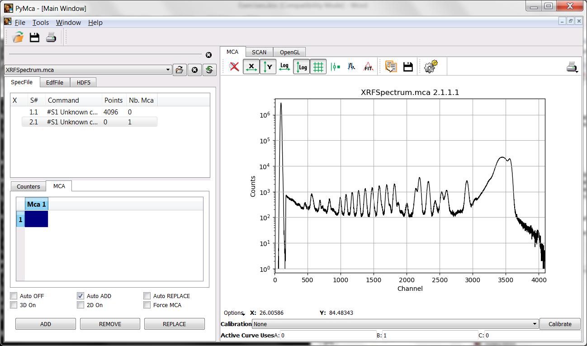

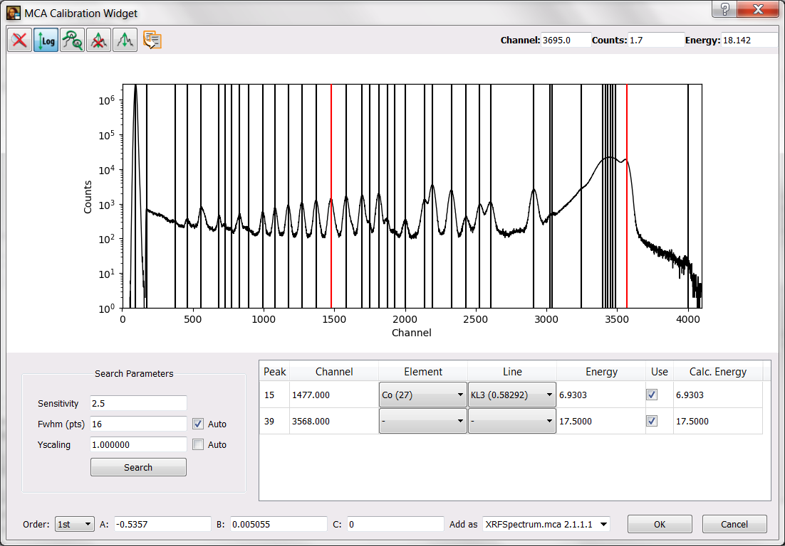

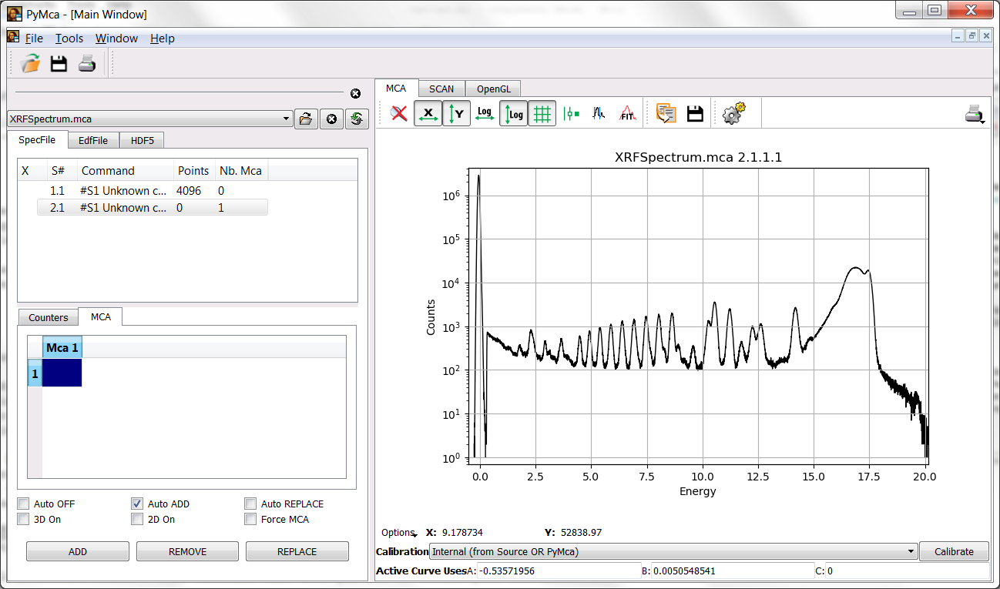

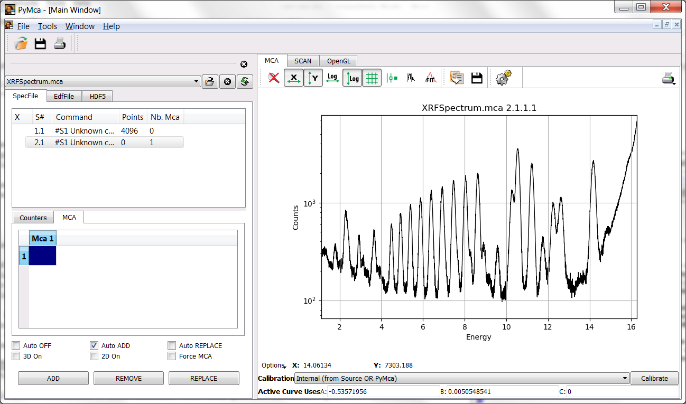

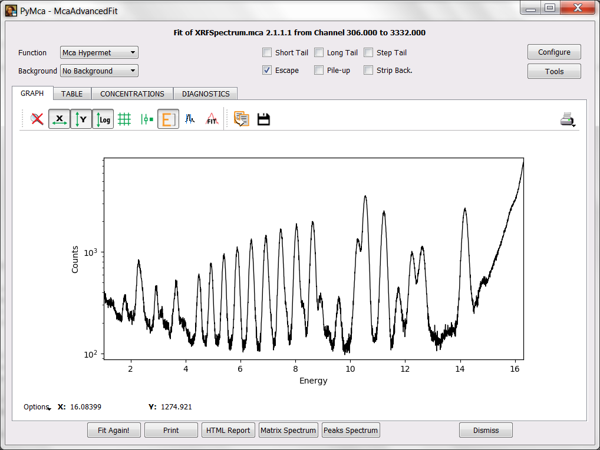

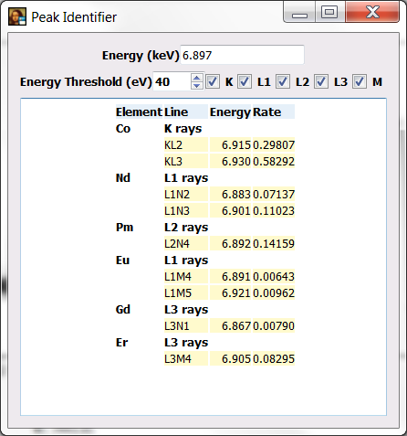

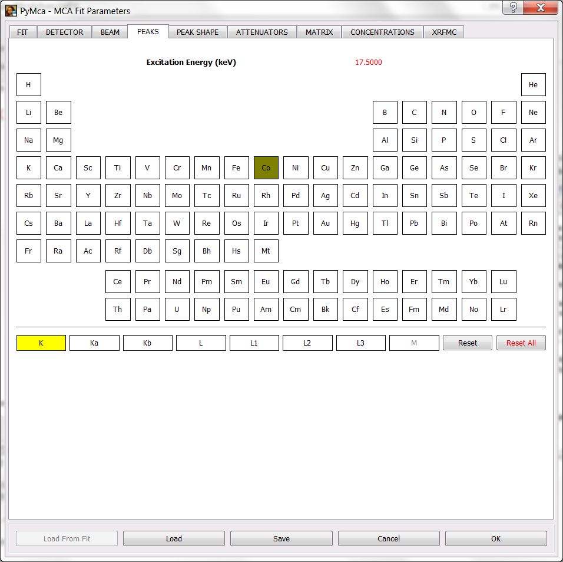

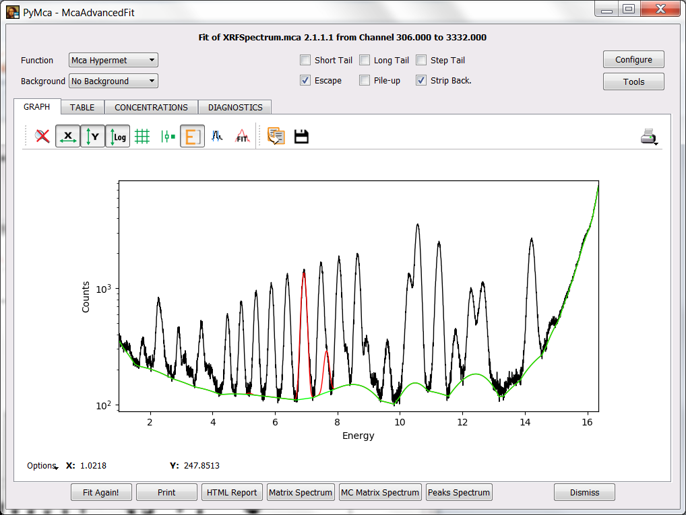

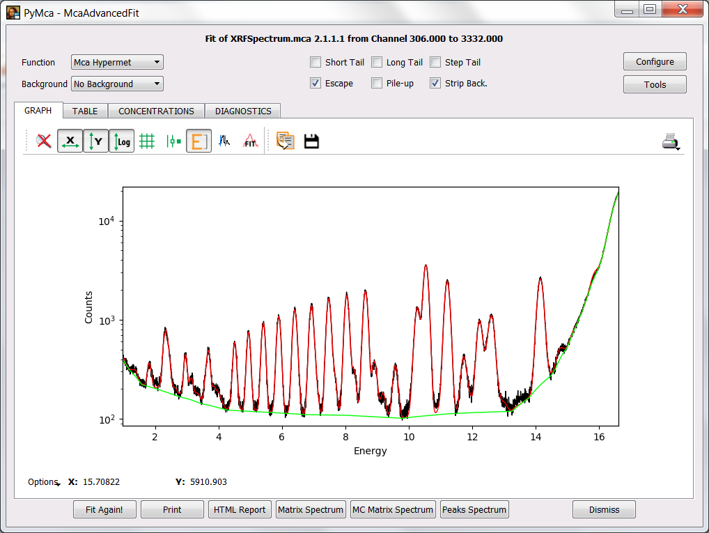

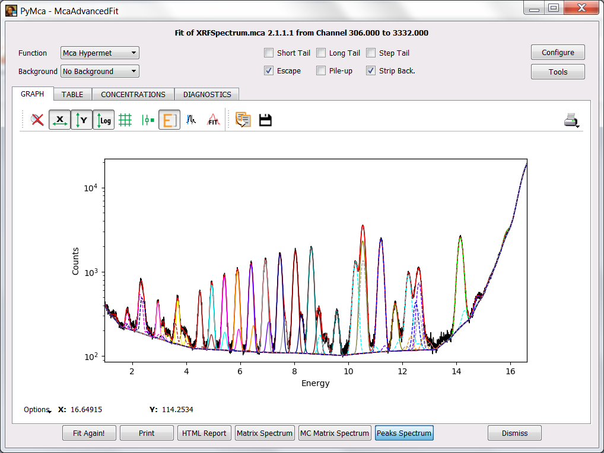

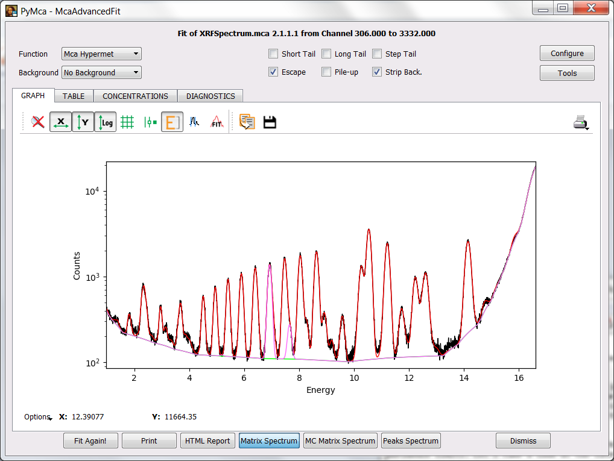

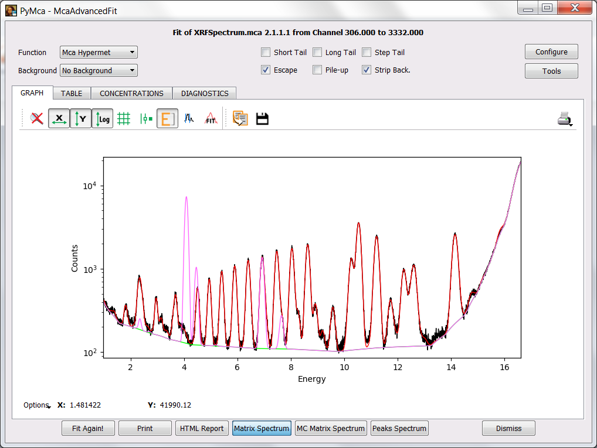

.. contents::
   :local:

Introduction
------------

Many synchrotron users performing X-ray fluorescence experiments are interested in imaging the distribution of elements in their samples. However, they tend to show little interest in learning how to perform quantitative X-ray fluorescence (XRF) analysis and that can lead to the obtention of wrong elemental distribution maps.

One has to take into account that even for pure imaging experiments one needs to calibrate the spectra, to identify the different elements in the sample and, most of the times, perform some fitting in order to resolve overlapping peaks of different elements. At this point users might not be aware that the relative peak areas they are extracting may be wrong because they did not take into account the modification of the database peak ratios by the conditions of the experiment. Simply introducing the experimental conditions and a guestimate of the sample composition is often enough to properly extract the signal from the different elements.

The additional step to take to go from pure qualitative to quantitative analysis is a very small one if a minimum of care was taken (for instance recording the acquisition time and incoming flux and a known sample has been measured).

Exercise
--------

The objective of this exercise is to get familiar with x-ray fluorescence analysis. For this, we are going to work with a spectrum from a thin film standard although we'll make some simplifications.

Step 1: Loading the data
........................

The data required for this exercise are supplied with PyMca and can be loaded into the program via the main window File menu following the sequence File->Open->Load Training Data->XRF Analysis.

The format associated to that spectrum is the simplest that PyMca can read. It is just a single column of numbers corresponding to the counts in the different channels. Under that situation, PyMca does not know if those data belong to an XRF experiment or to something else and offers two different visualization modes. One generic and one specific to XRF. 

Your first task is to achieve the situation shown in the figure below where the data are present in the MCA tab of the main window in a semilogarithmic plot.

|img_01|

Step 2: Calibrating the data
............................

If it is your first time with PyMca, you should take a look at the `Calibration tutorial <http://www.esrf.fr/computing/bliss/downloads/pymca/calibrationtutorial.htm>`_

The excitation energy was about 17.5 keV. Very often this is enough information for an initial calibration. However, this detector presented a very important offset and you will need an addition calibration point. Just imagine you have previously measured a cobalt sample and that you know that the peak around channel 1474 corresponds to the main emission line of Co.

You may reach the situation illustrated below where the calibration window is shown. You have to press the OK button to validate the calibration.

|img_02|

At this point you should be back to the main window without any change respect to the previous situation. Prior to go any further, you should instruct PyMca about what calibration you intend to use. Unless you have changed the name of the calibration, choosing Internal in the calibration combo box should apply the just calculated one to the spectrum leading to the situation below.

|img_03|

Under the calibration combo box, following *Active curve uses*, you will see the calibration actually applied. It should be close to A=-0.5, B=-0.005 and C=0. (Hint: Make sure you have selected a first order calibration when calculating the calibration). If it is very different your calibration is wrong and you will experience a lot of difficulties later on.

Step 3: Select your fit region
..............................

We already have a calibrated spectrum. The rest of the exercise will use the McaAdvancedFit window.

Prior to reach that window, we should select the region of the sample we'd like to analyze. For that, we have to zoom in that region by pressing and dragging the mouse. PyMca implements a zoom stack, you can go back by pressing the mouse right button or by pressing the reset zoom icon.

At the very least, you should always leave the cut at the low energy side corresponding to the low-level discriminator of your acquisition system out of the fitting region. Something around 1.0 keV should be OK in this case.

PyMca (still!) implements a very poor description of the scattering peaks. Unless you absolutely need it, you will obtain better results by limiting the high energy side of the region to the rail of the scattered peaks. Something like 16.3 keV should be a good upper limit.

|img_04|

At this point we are ready to access the McaAdvancedFit window by pressing the fit icon and selecting the *Advanced* option.

Step 4: Using the Peak Identifier
.................................

The first thing you will get is a message telling you that no peaks have been defined. PyMca has very good peak search routines and it could do a very good guess about the elements present. However, the author(s) consider that the responsibility should fall on the person carrying the analysis.

In order to allow PyMca to give you some hints about what elements can be associated to a peak, you need to toggle the energy axis on. Your next target should be to obtain the image below.

|img_05|

If you now click on top of a peak, PyMca will show you the peaks that can be associated to that energy. If you click at around 6.9 keV. PyMca should show you the peak identifier.

|img_06|

You will be presented with a table of elements, peak families and rates within the family of all the elements emitting x-ray within the specified energy threshold around the selected energy.

As a rule of thumb, you should aim at identifying the most intense peaks. Why? Because that can help you decide to what element they belong. For instance, the L3 lines are usually more intense than the L2 lines or L1 lines. If the program proposes you the L2 lines of one element and the L3 lines of other element, there are strong chances of having the element with the L3 lines because if it would be the element with the L2 lines there should be a stronger peak somewhere in the spectrum corresponding to the L3 lines of that element. Of course, that is to be considered as a hint. It may well happen that the intense L3 lines are hidden beneath the peak of another already identified element...

Step 5: Fit Configuration
.........................

In this example you could already start adding peaks families to be fitted immediately because the sample is relatively thin and matrix effects are small. However, you should aim at doing the things properly and enter as much information as possible into the fit configuration.

The experimental conditions are excitation energy around 17.5 keV, Si detector 450 micron thickness and Be window of 8 micron thickness. For the sake of simplicity assume the sample is 100 micron water and contains 500 ppm of Co. Incident beam angle is 0.1 degrees and fluorescence beam angle is 90 degrees. There is an air path between sample and detector window of 2 mm.

To will enter the fit configuration by pressing the Configure button.

To enter the experimental setup you will need to use the ATTENUATORS tab and the MATRIX tab. The incident beam energy is set into the BEAM tab.

Concerning the FIT tab, at this point just make sure the *Stripping* check box is selected in order to have some baseline to be applied to your fit.

If you have done that and you select the PEAKS tab, you will see the excitation energy in red. Below you will see the selection of the Co K lines as peaks to be fitted.

|img_07|

Press OK to accept the changes. You will be back to the fit window and by pressing the Fit icon or the Fit again! button you should obtain a fit similar to the one displayed below.

|img_08|

As you see the background still needs some adjustment. You can do it via the corresponding SETUP button at the FIT tab of the fit configuration widget.

You should spend some time going to the fit configuration to add peaks and back to the fit window to perform fits. WARNING: It is advisable to save your fit configuration from the fit configuration widget via the Save button. That can save you a lot of time in case of problems because you could restart form that point.

You can take the image below as encouragement.

|img_09|

If you need to take a look at the individual contributions of the different elements to the fitted spectrum, you can do so by selecting the *Peaks Spectrum* button.

|img_10|

If you want to highlight a particular element contribution, you should make the legends widget appear by pressing on Options and selecting Legends. It is not shown here in order not to make the exercise too simple (remember *No pain, no gain*).

Hint. You should not need more than 18 elements to achieve the same fit quality.

Step 6: Concentrations
......................

The additional step to calculate concentrations is very simple. One either needs to know some details about the system (flux, acquisition live time, solid angle) or to use an internal standard.

If we have set the sample is water with 500 ppm of Co, we can go back to the fit configuration and select in the CONCENTRATIONS tab the *From matrix composition* check box. You can also enter Co as *Matrix Reference Element* if you wish.

To get the concentrations is as easy as selecting the CONCENTRATIONS tab of the 
advanced fit window after performing a fit.

Hint: If everything is OK, the concentrations of all the elements present in the sample should be in the vicinity of 500 ppm (0.0005 mass fraction).

In real life you often do not have an internal standard. However, you could imagine that you have just measured a reference sample you have just prepared with a concentration of 500 ppm Co in water and that you want to calibrate your system. Then, obviously, the Co concentration given by the program is exactly 0.0005 because it is used as internal standard. To calibrate your system all what you have to do is to select the *From fundamental parameters* check box and modify the Active area, distance, time to match those of your experiment and finally play with the flux until the concentration of Co is back to 0.0005. From there on you will be ready to use your system without an internal standard. You would have removed the water-with-Co sample and measured our unknown sample.

Step 7: Using the Matrix Spectrum
.................................

PyMca can be used to calculate the expected measured spectrum given the experimental conditions and the sample composition.

If you have performed the previous steps, you just have to perform a fit and press the Matrix Spectrum button. You can see something similar to the figure below where besides the spectrum and the fit there is a spectrum corresponding to the matrix (in this case is shown in magenta but the colors may vary). In our case it is just Co what is shown.

|img_11|

We can use this PyMca feature to measure the thickness of layers or to estimate confidence limits. Let's take a look at the later.

We go back to the fit configuration and select the Sc K-line as element family of peaks to be fitted and we perform a fit. If we go to the CONCENTRATIONS tab we'll see that PyMca reports a concentration of the order of some ppms. The question is, can we trust that information?

A simple exercise is to add Sc at different amounts to the sample composition and to ask the program to calculate the matrix spectrum. We can start with a fairly large amount like 1 % to visualize where the signal should appear. Then we just have to repeat the exercise lowering the concentration until we reach a point below which we would not trust anything. The figure below shows the matrix spectrum with 1 % of Scandium.

|img_12|

After performing the exercise, you will easily conclude that the concentration of Sc in the sample, if any, it is below the detection limits of our system under the exact conditions of our experiment (including sample!).

Step 8: Final Comments
......................

If you want, you can also observe how the changes on the calculated concentrations when changing the attenuation conditions:

     - play with an air path between 1.0 mm and 100 mm (what happens at low energies?)
     - play with a detector thickness between 10 micron and 1 mm (what happens with the concentrations at high energies?) 

The information to carry out this exercise is also available within PyMca. To access it, you just have to select the FILE tab of the widget appearing after a right click on the list shown after loading the file (right-mouse click on #S1 Unknown...) and *Show scan header* selection).

