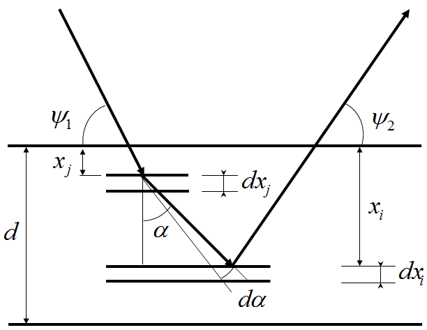
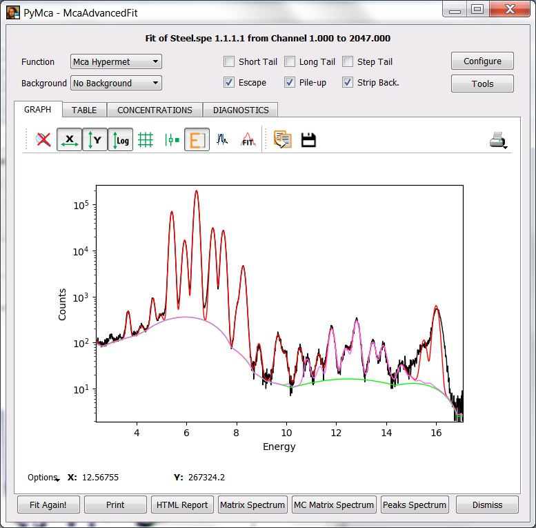
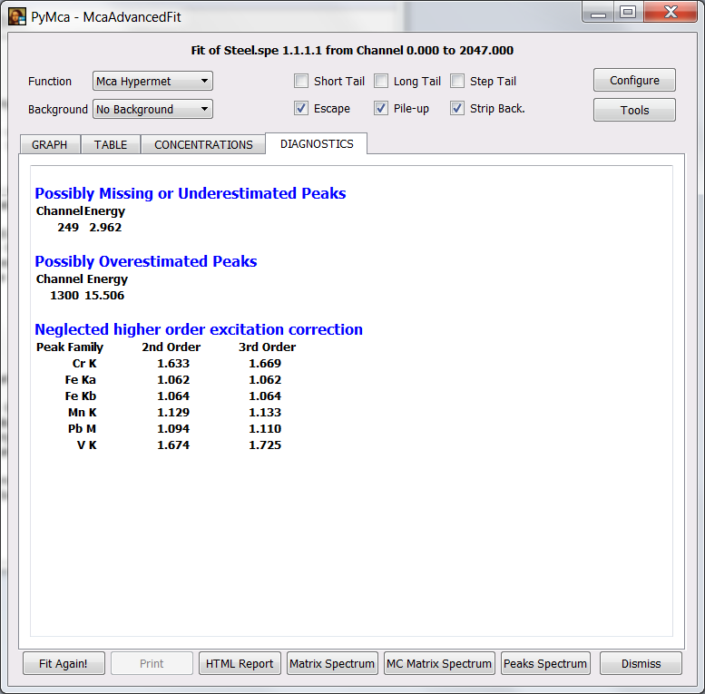
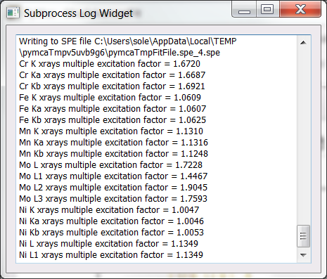

Accounting for higher order excitations
=======================================

.. contents::
   :local:

Introduction
------------

It can happen that the X-rays emitted by a sample element j excite other element i present in the sample up to a non-negligible extent as compared to the direct excitation process. The figure below illustrates the case for secondary excitation.

|img1|

Obviously it may happen that the element i excite in turn other element up to a non-negligible amount and so son. PyMca can account for these processes using two totally different approaches. One based on the use of analytical formulae and one based on the use of a Monte Carlo code.

The analytical approach implemented in PyMca makes use of the `formulation of D.K.G. de Boer  <https://doi.org/10.1002/xrs.1300190312>`_ that is well adapted for its use with multiple-layer samples.

The Monte Carlo approach uses the `XMI-MSIM code <https://doi.org/10.1016/j.sab.2012.03.011>`_ mainly developed by Tom Schoonjans and Laszlo Vincze The code can be freely downloaded `here <http://lvserver.ugent.be/xmi-msim/>`_

Currently, PyMca simply evaluates the ratio between the expected measured signal considering primary excitation and the expected measured signal considering higher-order excitation. That ratio gives the correction to be applied to the concentrations calculated just considering primary excitation.

Exercise
--------

We are going to learn how to account for secondary excitations using the spectrum from a stainless steel sample.

The data are provided with PyMca. To access them, just start a new session of PyMca and, via the File menu, access the data following the sequence File -> Open -> Load Training Data -> Tertiary Excitation. At this point, PyMca will show you the spectrum in the MCA window.

We are going to skip the usual procedure of calibrating the spectrum. Therefore we are going to press the fit icon and select the Advanced fit option to reach our usual McaAdvancedFit window where we perform our XRF analysis.

A fit configuration file named Steel.cfg is also provided. As supplied, it only considers quantification following primary excitation. To load it, just press the Configure button, load the file from the file dialog that will appear after pressing the Load button and press OK to return to the McaAdvancedFit window. If you press the Fit Again! button or the fit icon, you should be able to obtain something similar to the figure below (please note the change to energy axis and logarithmic scale via the appropriate toolbar icons).

|img2|

At this point we can calculate the concentrations by selecting the CONCENTRATIONS tab. We can also select the DIAGNOSTICS tab. If we do so, we'll see that the program warns about secondary or tertiary excitation contributions when the correction is more than 1 %. You should see that neglecting secondary excitation would lead to overestimating the concentration of Cr in the sample by more than 60 % and that even tertiary excitation is not negligible.

|img3|

If XMI-MSIM is not installed, the MC Matrix Spectrum button will not be shown. If it is installed, you can also calculate the corrections using it. You just need to press the MC Matrix Spectrum button. You should get a window open where the output of the code will be shown. Under windows sometimes you need to use the 32-bit version of XMI-MSIM. The first time you run the XMI-MSIM code for a given detector and geometry it can take quite long. Subsequent runs are very fast for a Monte Carlo code. Besides showing the Monte Carlo calculated spectrum following 1 or 4 interactions in the sample, the logging window will show you the corrections we are interested on.

|img4|

Whether using the analytical formulas or the Monte Carlo approach, accounting for those corrections is as simple as selecting the appropriate option in the CONCENTRATIONS tab. You will see how the different concentrations are corrected following the selection of the appropriate checkbox to consider secondary, tertiary or Monte Carlo correction. If you know your samples require account for secondary or higher order excitations, you should select the appropriate checkbox of the CONCENTRATIONS tab of the fit configuration as part of the fir configuration itself.

