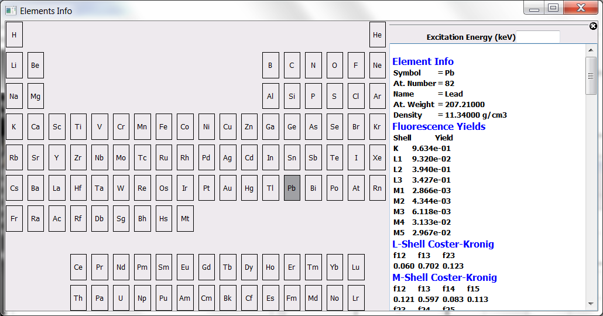
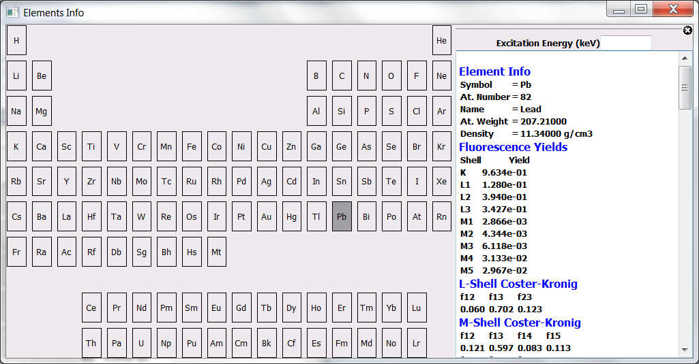

Customizing X-Ray Data
======================

.. contents::
   :local:

Introduction
------------

A program for X-ray fluorescence analysis needs:

- A database
- A Physics engine
- A set of algorithms for spectrum deconvolution
- A user interface 
  
The developers of *PyMca* put the maximum degree of effort into correctness and transparency but they are not at the origin of the data used by the program. The theoretical data may not be reliable in some cases (in fact we know they are not!) and, since we do not have the time to perform a systematic study or to determine them ourselves, we have made sure the program can be modified by the user in order to adapt it to other data that the user may consider more reliable.

Exercise
--------

The objective of this exercise is to teach you how to modify the theoretical data used by *PyMca*. For this, we are going to take the case of the L1-shell fluorescence yield of Pb and we are going to force *PyMca* to use a different value from the supplied default one.

Step 1: Getting the data
........................

The L1-shell fluorescence yields are stored in the `LShellConstants.dat <https://github.com/vasole/fisx/blob/master/fisx_data/LShellConstants.dat>`_ file of the `fisx library <https://github.com/vasole/fisx>`_.

As explained in the `Customizing PyMca section <../../customization/settings/index.html>`_, we have to download that file and put it into the data directory of the settings folder. You can do it by opening the `link <https://github.com/vasole/fisx/blob/master/fisx_data/LShellConstants.dat>`_ above in your browser, clicking on the button with the text Raw shown at the right side of the page and saving the file to the mentioned directory.

Step 2: Initial verification
............................

In order to check the data *PyMca* is using, we can open the *Elements Info* tool available from the *Tools* option of the menu of the *PyMca* main window.

We can click on the atomic symbol of Pb in order to display the information used by the program.

|img_01|

We should find a value of of 0.0932 for the lead L1-shell fluorescence yield. This value was obtained by interpolating the theoretical values in TABLE I from the article by M.H. Chen, B. Crasemann, H. Mark in *Widths and fluorescence yields of atomic L-shell vacancy states Physical Review A volume 24 number 1 (1981) 177-182* 

We are going to update that value with the value 0.128 recommended in Table 2 from the article by J.L. Campbell *Fluorescence yields and Coster-Kronig probabilities for the atomic L subshells. Part II: The L1 subshell revisited* with `doi:10.1016/j.adt.2008.08.002 <https://dx.doi.org/10.1016/j.adt.2008.08.002>`_

DISCLAIMER: The goal of this exercise is to show you how to update the data used by the application. We are not endorsing the use of the data provided by Campbell because we have not made an exhaustive study for all the elements. Despite that, we have to say that Campbell has performed such systematic studies and the value Campbell recommends for lead is indeed much closer to the value used in our own research than the theoretical one. You SHOULD verify yourself if, when calculating concentrations using the L1, L2 and L3 lines of Pb, you find a) a systematic discrepancy of the value of the L1-derived concentrations respect to the concentration values derived from the L2 and L3 shells and b) if you can correct the discrepancy by changing the L1-shell fluorescence yield of lead.

Step 3: Modifying the data
..........................

You need an editor not modifying line endings. That is usually not a problem for Linux or MacOS users.  For windows users `Notepad++ <https://notepad-plus-plus.org>`_ or `Vim for windows <https://www.vim.org>`_ could be good choices.

We just have to get to the line 93 of the file, replace the value 0.0932 by the value 0.128 and save the changes.

Step 4: Final verification
..........................

We close *PyMca* if we did not do it yet and we start it again.

If we repeat the operation described in the step 2 above, we should get now the modified value.

|img_02|

Please keep in mind the DISCLAIMER above.
