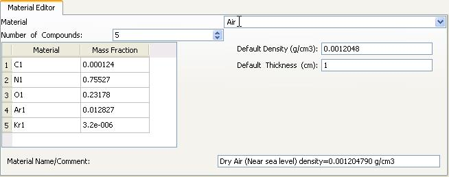
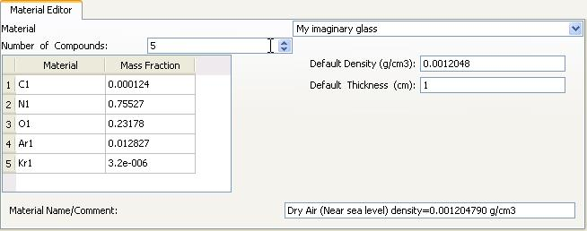
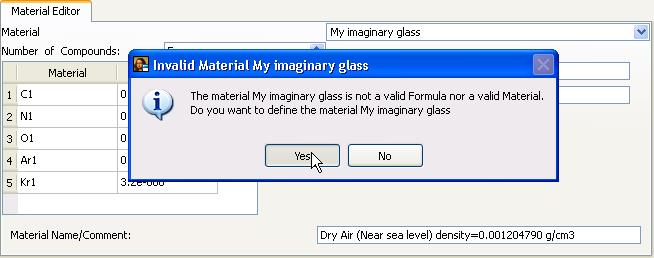
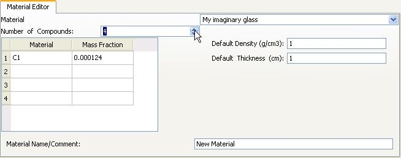
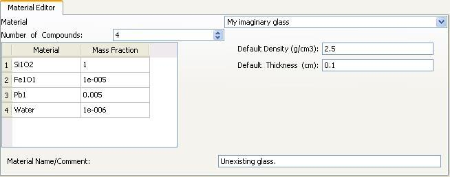
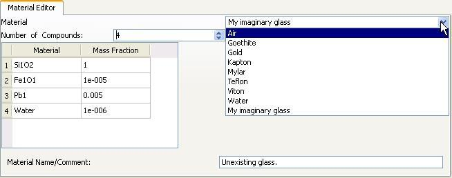
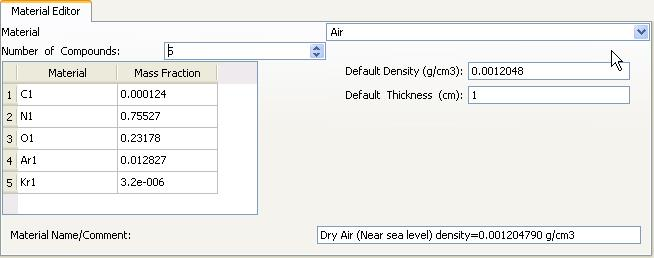
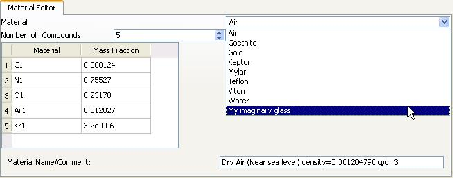

Defining new materials in the material editor
=============================================

The material editor is located at the bottom of the ATTENUATORS tab of the the fit configuration dialog.

|img1|

WARNING: Unlike the rest of the fit configuration dialog, the changes in the material editor are immediate. If you change one material, that material will be changed even if you choose to cancel the fit configuration dialog. Loading a new configuration file will import the new materials defined in that configuration file. Existing materials will be redefined and new ones will be added.

The steps to define a material are:

    1 - Type the name of your material at the material combo box.
    2 - Enter the number of compounds in your material
    3 - Fill the table
    4 - Fill the optional fields
    5 - Check that everything is fine

1 - Type the name of your material at the material combo box
------------------------------------------------------------

The program will not accept names like SRM1832. Why? Because it will find that the material name can be split in as many letter groups as numbers and it will consider that as being a potential formula without testing its validity. To be able to combine letters and numbers, just add a character that is not a letter nor a number (SRM-1832, SRM_1832 or just a space between "SRM" and "1832").

|img2|

You will get a message asking you to confirm you want to define a material.

|img3|

2 - Enter the number of compounds in your material
--------------------------------------------------

Select the number of compounds with the help of the "Number of Compounds" spin box. The table below will adjust its number of rows accordingly.

|img4|

3 - Fill the table
------------------

Any valid formula or previously defined material can be entered in the material column while the mass fraction has to be a valid number. The program will internally normalize the given fractions to unity.

|img5|

4 - Fill the optional fields
----------------------------

The rest of the fields are not mandatory but they are very convenient. They can save you some time later on when selecting the newly defined material because the program will fill the default density (and thickness if it is not already filled) and you will not have to search around for the density. The comment is only used for your own information.

|img6|

5 - Check that everything is fine
---------------------------------

In order to make sure that everything is correct, you should select a previously defined material, and then select again your just defined material.
You should find the same information you entered.

|img7|

|img8|

|img9|

|img10|

