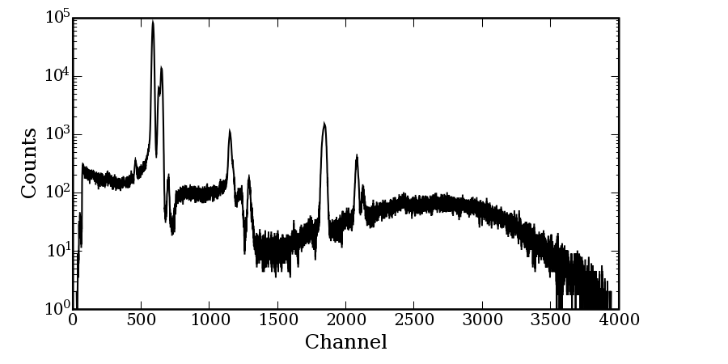
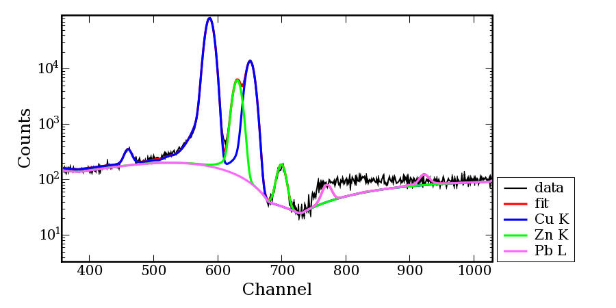
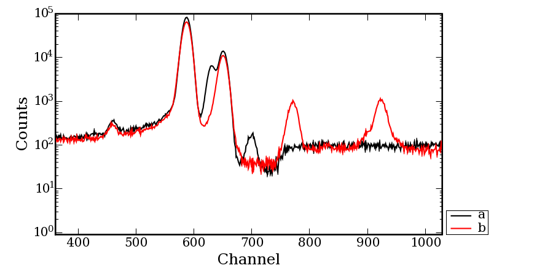
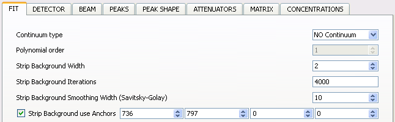
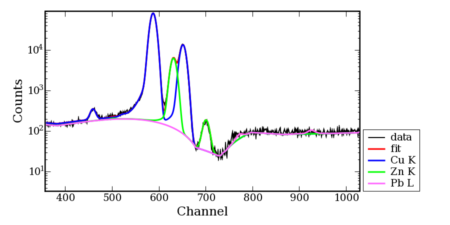

Understanding and using the strip background
=============================================

- Introduction
- Batch tips
- Using the anchors

Introduction
------------

The strip background is probably PyMca's  most popular background model.

In its simplest implementation it is just as an iterative procedure depending on two parameters. These parameters are the strip background width w, and the strip background number of iterations. At each iteration, if the contents of channel i, y(i), is above the average of the contents of the channels at w channels of distance, y(i-w) and y(i+w),  y(i) is replaced by the average. At the end of the process we are left with something that resembles a spectrum in which the peaks have been "stripped".

Clearly, that implementation would give us a baseline passing by the lower band of the statistical noise associated to the spectrum. This problem can be solved by performing a smoothing prior to calculate the background. The parameter associated to the smoothing is the strip background smoothing width.

All these parameters are accessible in the FIT configuration tab of the configuration window.

Batch tips
----------

The strip background is very useful, but badly parametrized can be very time consuming. You should use the SNIP background instead. If you still want to use the strip background for batch processing, please keep in mind the following hints.

You should always aim to the lowest number of iterations that gives you acceptable results. You should avoid things like using 20000 iterations. That default value is there just for historical reasons. A strip background width of around 70% of your peaks full-width at half maximum and a number of iterations around 4000 should be a good starting point.

If you are using linear fits without strip background or no background at all, you should set the strip background number of iterations to zero. Why? Because even if you decide not to use the strip background, it is internally used to evaluate the starting parameters of the analytical background models. If you are not going to use any background or you are performing a linear fit it is just wasted time.

Using the anchors
-----------------
It may happen your actual background presents a high curvature because of whatever reasons. The spectrum below is really a challenge for any background algorithm because of the pile up artifact around channel 760.

|img1|

That spectrum belongs to a series of measurements on copper containing alloys. To make the things more difficult, one of the goals of the measurements was to evaluate the lead content in the alloys. As it can be seen below, there are lead peaks just at the region where we have a sharp discontinuity and with the strip background as just described we face the situation that we find lead even when there is no lead present:

|img2|

One way to proceed in such cases is to use anchors. Anchors are simply channels that will remain fixed during the stripping procedure. That feature is avaible from PyMca version 4.0.9 on. Since the energy calibration can change during the fitting procedure, anchors have to be given in channels and not in energy.

|img3|
Spectrum a (in black) is an alloy containing copper and zinc but no lead. Spectrum b (in red) contains lead. In our problem, if we were going to perform a batch fit, we could take a close look at the lead containing spectrum and set one anchor at each side of the peak falling on the artifact. In this case we would select the "Strip Background use Anchors" check box and enter the values 736 and 797.

|img4|

That would still leave us a small signal when dealing with non lead containing alloys but it would make sure no lead would be removed. In addition, that "offset" could be easily evaluated with a standard as it was our case.
Fit with lead anchors

|img5|

Interactive fits would not present any problem because different anchors could be used. In particular one could put one anchor at the discontinuity and get an even better background description.

